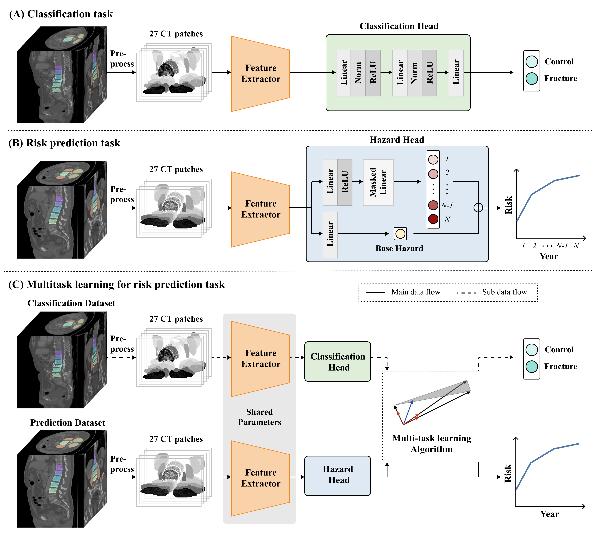

# Enhancing Vertebral Fracture Prediction Using Multi-Task Deep Learning  

Official implementation of the paper:  
"Enhancing Vertebral Fracture Prediction Using Multi-Task Deep Learning: Computed Tomography Imaging of Bone and Muscle"

<p align="center">
  
</p>

---

## 🛠️ Environment Setup

We recommend using **Python 3.9+** and setting up a virtual environment:

```bash
git clone https://github.com/saemee007/vertebral-fracture-prediction.git
cd vertebral-fracture-prediction

# Install dependencies
pip install -r requirements.txt
```
---

## 📂 Model Checkpoint Installation

To use the pre-trained model checkpoint, follow these steps:

1. **Download the Model Checkpoint from Google Drive**:
   
   - Visit the [Google Drive Link](https://drive.google.com/file/d/1QCLPMZ5Q8F1jB1FioddYUz3477tgTVTJ/view?usp=sharing) and download the checkpoint file (e.g., `det_model_checkpoint.pth`).
   - Visit the [Google Drive Link](https://drive.google.com/file/d/1kpRYRYFksrnEr3nrF3xEEeO7LNTQDmgk/view?usp=sharing) and download the checkpoint file (e.g., `seg_model_checkpoint.pth`).

2. **Move the Model Checkpoint to the Appropriate Directory**:
   
   ```bash
   mv /path/to/downloaded/det_model_checkpoint.pth exp/
   mv /path/to/downloaded/seg_model_checkpoint.pth v7_2d_unet/exp/
   ```
---
## 📦 Data Setup

Due to medical data privacy, we do not distribute the dataset publicly.
To reproduce our results:

Obtain the CT scan data with bone and muscle segmentation labels.
Organize the data as follows:

```bash
data/
├── cls/nifti/
    ├── 001.nii.gz
    ├── ...
└── pred/nifti/
    ├── 001.nii.gz
    ├── ...

```

Update config with your local data paths.

---
## 🔄 Data Preprocessing

Run the preprocessing pipeline to prepare the data for training:
```bash
python data_preprocess.py --config config/data_preprocess_config.yaml
```
---
## 🧠 Training

To train the multi-task model:
```bash
python train_MTL.py --config config/config.yaml m--cls_data data/datasets/cls_data.csv  --pred_data data/datasets/pred_data.csv --slices_select random --view axial --task MTL --gpus 0 --split 0 --sort_slice --nashmtl 
```
---
## 📋 Citation

If you find this work helpful, please cite:
```bibbex
@article{yourbibtex2025,
  title={Enhancing Vertebral Fracture Prediction Using Multi-Task Deep Learning: Computed Tomography Imaging of Bone and Muscle},
  author={Kong et al.},
  journal={...},
  year={2025}
}
```

---
## 📧 Contact

For questions, please contact:
📮 saemee0007@gmail.com
